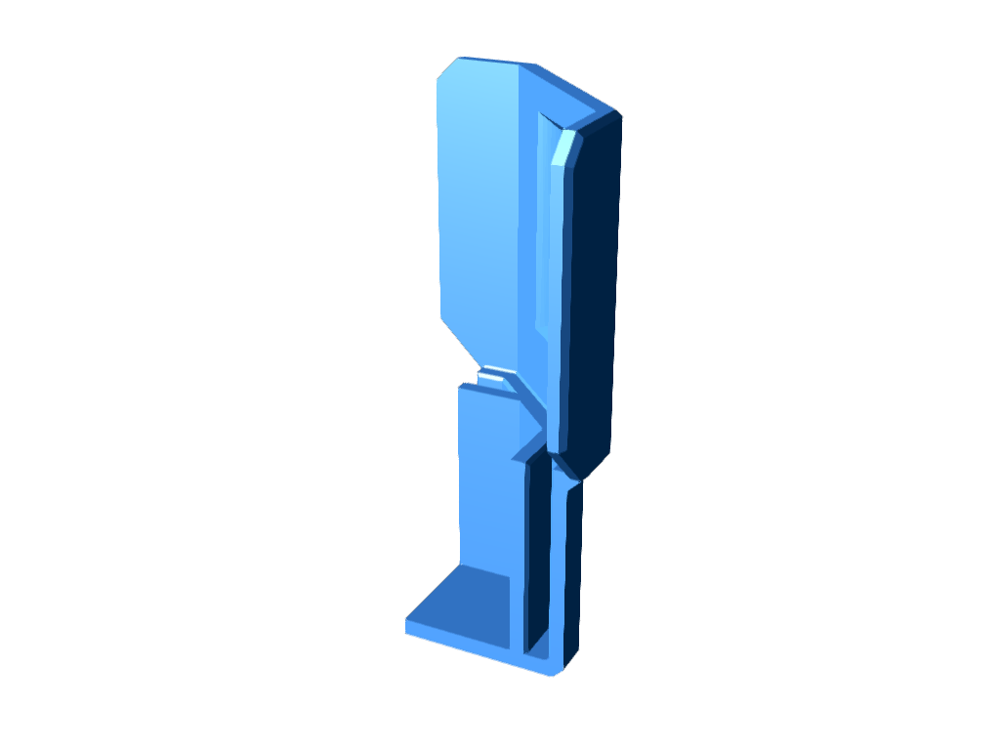
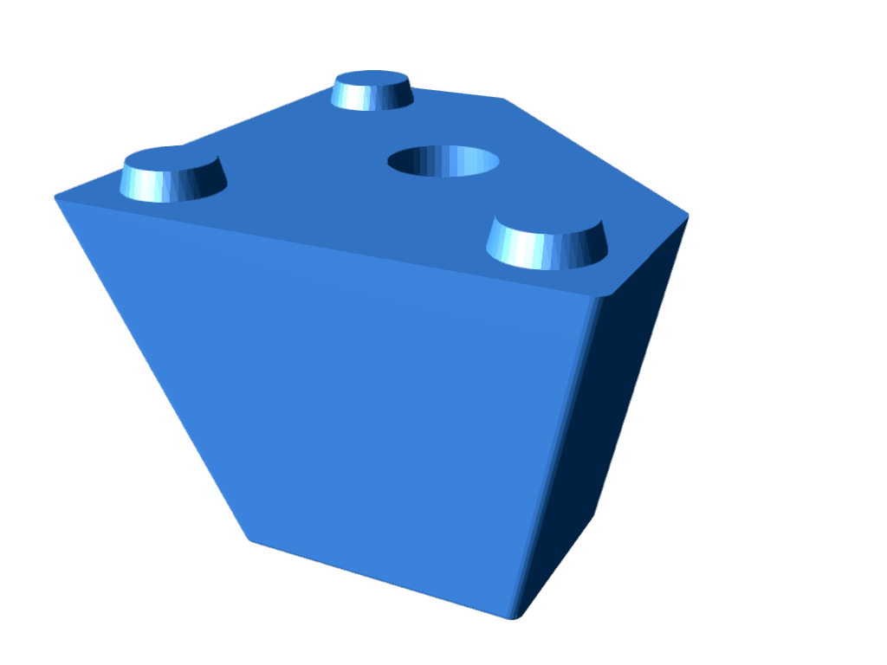
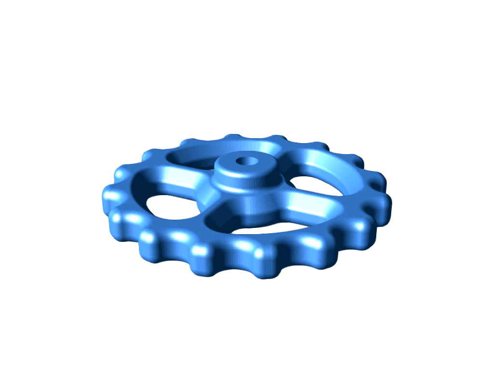
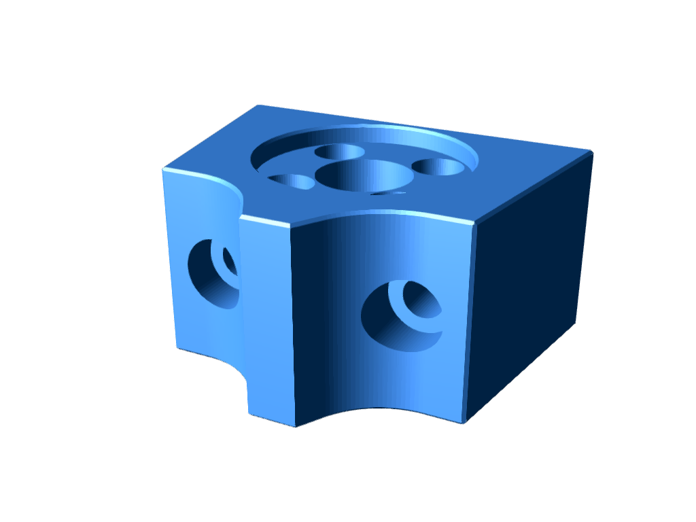
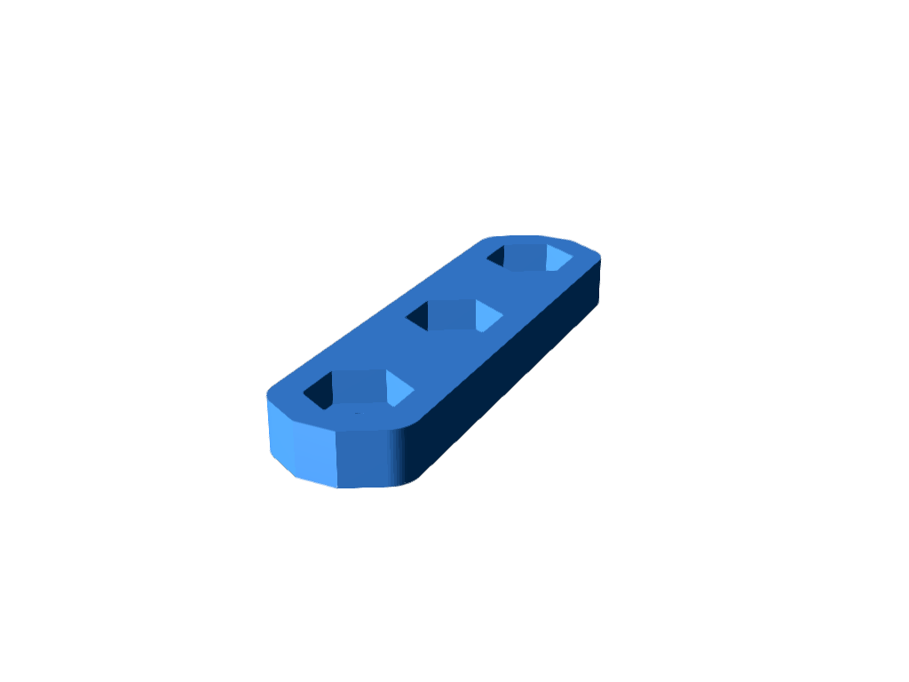

# Fraxinus1k

See [https://fraxinus.jp/docs/assembly/step1/](https://fraxinus.jp/docs/assembly/step1/) for details.

| STL file | thumbnail | filament | print qty. |
| :---: | :---: | :---: | :---: |
| [Bracket_LCD_L_r.stl](./STLs/Bracket_LCD_L_r.stl) |  | ABS | 1 |
| [Bracket_LCD_R_r.stl](./STLs/Bracket_LCD_R_r.stl)|  | ABS | 1 |
| [Bracket_Motor_A_r.stl](./STLs/Bracket_Motor_A_r.stl)|  | ABS | 1 |
| [Bracket_Motor_B_r.stl](./STLs/Bracket_Motor_B_r.stl)|  | ABS | 1 |
| [Bracket_XY_L1_r.stl](./STLs/Bracket_XY_L1_r.stl)|  | ABS | 1 |
| [Bracket_XY_L2_r.stl](./STLs/Bracket_XY_L2_r.stl)|  | ABS | 1 |
| [Bracket_XY_R1_r.stl](./STLs/Bracket_XY_R1_r.stl)|  | ABS | 1 |
| [Bracket_XY_R2_r.stl](./STLs/Bracket_XY_R2_r.stl)|  | ABS | 1 |
| [Cap_AFSC-2020_r.stl](./STLs/Cap_AFSC-2020_r.stl)|  | ABS | 2 |
| [Cap_B_Idler_v4.stl](./STLs/Cap_B_Idler_v4.stl)|  | ABS | 2 |
| [Cap_Z_Carridge_r.stl](./STLs/Cap_Z_Carridge_r.stl)|  | ABS | 1 |
| [Foot_AFSC-2020-15.stl](./STLs/Foot_AFSC-2020-15.stl)|  | ABS | 4 |
| [Frame_Motor_A1_r.stl](./STLs/Frame_Motor_A1_r.stl)|  | ABS | 1 |
| [Frame_Motor_A2_r.stl](./STLs/Frame_Motor_A2_r.stl)|  | ABS | 1 |
| [Frame_Motor_B1_r.stl](./STLs/Frame_Motor_B1_r.stl)|  | ABS | 1 |
| [Frame_Motor_B2_r.stl](./STLs/Frame_Motor_B2_r.stl)|  | ABS | 1 |
| [Hand_Twist_Nut.stl](./STLs/Hand_Twist_Nut.stl)|  | ABS | 4 (optional) |
| [Holder_AC_Switch_r.stl](./STLs/Holder_AC_Switch_r.stl)|  | ABS | 1 |
| [Holder_Fan_5015_r.stl](./STLs/Holder_Fan_5015_r.stl)|  | ABS | 1 |
| [Holder_Head-belt_r.stl](./STLs/Holder_Head-belt_r.stl)|  | ABS | 1 |
| [Holder_Hotend_KP3S_21b.stl](./STLs/Holder_Hotend_KP3S_21b.stl)|  | ABS | 1 |
| [Holder_Idler_L_r.stl](./STLs/Holder_Idler_L_r.stl)|  | ABS | 1 |
| [Holder_Idler_R_r.stl](./STLs/Holder_Idler_R_r.stl)|  | ABS | 1 |
| [Holder_Motor_E_Mold_r.stl](./STLs/Holder_Motor_E_Mold_r.stl)|  | ABS | 1 |
| [Holder_PCB_Main_r.stl](./STLs/Holder_PCB_Main_r.stl)|  | ABS | 1 |
| [Holder_Raspi3_Back-virtical_r.stl](./STLs/Holder_Raspi3_Back-virtical_r.stl)|  | ABS | 1 (optional) |
| [Holder_X_Limit_Switch_KP3S_v2.stl](./STLs/Holder_X_Limit_Switch_KP3S_v2.stl)|  | ABS | 1 |
| [Holder_Y_Limit_Switch_1kc.stl](./STLs/Holder_Y_Limit_Switch_1kc.stl)|  | ABS | 1 |
| [Holder_Z_Carridge_12C_r.stl](./STLs/Holder_Z_Carridge_12C_r.stl)|  | ABS | 2 |
| [Holder_Z_Motor_v3.stl](./STLs/Holder_Z_Motor_v3.stl)|  | ABS | 1 |
| [Holder_Z_Nut_1k_r.stl](./STLs/Holder_Z_Nut_1k_r.stl)|  | ABS | 1 |
| [Holder_Z_Shaft_1k.stl](./STLs/Holder_Z_Shaft_1k.stl)|  | ABS | 1 |
| [Limit_Knob_r.stl](./STLs/Limit_Knob_r.stl)|  | ABS | 1 (optional) |
| [Long_Nut_25x7_r.stl](./STLs/Long_Nut_25x7_r.stl)|  | ABS | 2 |
| [M2_Adapter_85mm_r.stl](./STLs/M2_Adapter_85mm_r.stl)|  | ABS | 6 |
| [Post_PCB_Main_r.stl](./STLs/Post_PCB_Main_r.stl)|  | ABS | 1 |
| [Skirt_Front1_L_r.stl](./STLs/Skirt_Front1_L_r.stl)|  | ABS | 1 |
| [Skirt_Front1_R_r.stl](./STLs/Skirt_Front1_R_r.stl)|  | ABS | 1 |
| [Skirt_Side_L_r.stl](./STLs/Skirt_Side_L_r.stl)|  | ABS | 2 |
| [Skirt_Side_R_r.stl](./STLs/Skirt_Side_R_r.stl)|  | ABS | 2 |
| [Spacer_2020_M3_r.stl](./STLs/Spacer_2020_M3_r.stl)|  | ABS | 6 (optional) |
| [Spacer_2020_M4_r.stl](./STLs/Spacer_2020_M4_r.stl)|  | ABS | 6 (optional) |
| [Spacer_4.2-8_9mmt_r.stl](./STLs/Spacer_4.2-8_9mmt_r.stl)|  | ABS | 6 |
| [Spacer_E_Mounter_r.stl](./STLs/Spacer_E_Mounter_r.stl)|  | ABS | 1 |
| [Tensioner_Knob_r.stl](./STLs/Tensioner_Knob_r.stl)|  | ABS | 6 (4 of them are optional) |
| [Tensioner_Motor_r.stl](./STLs/Tensioner_Motor_r.stl)|  | ABS | 2 |
